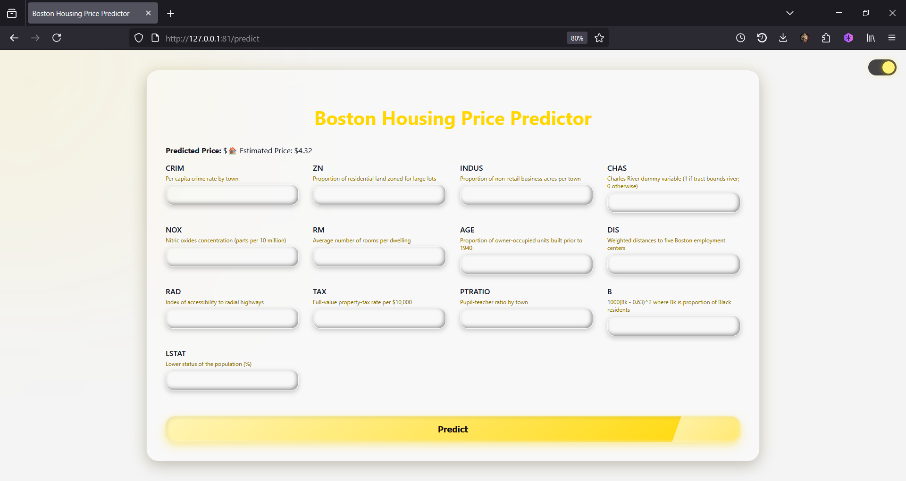
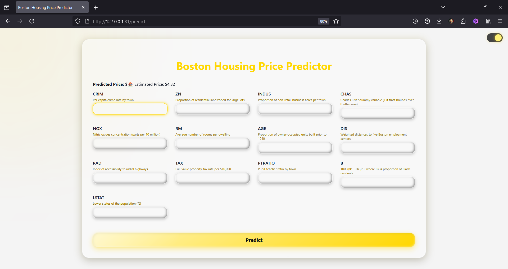
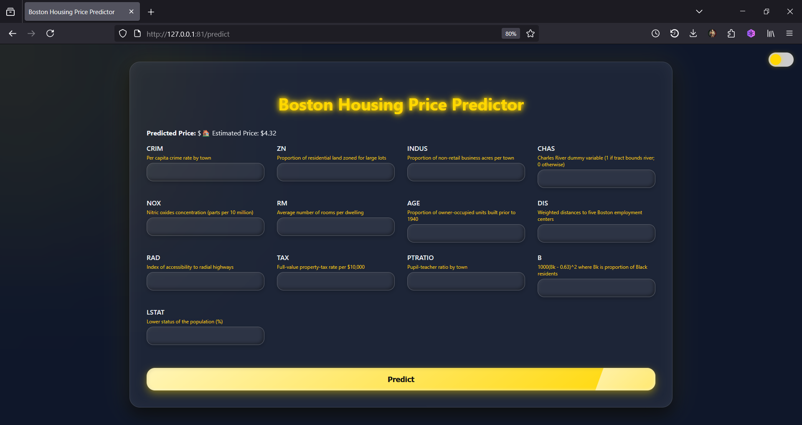
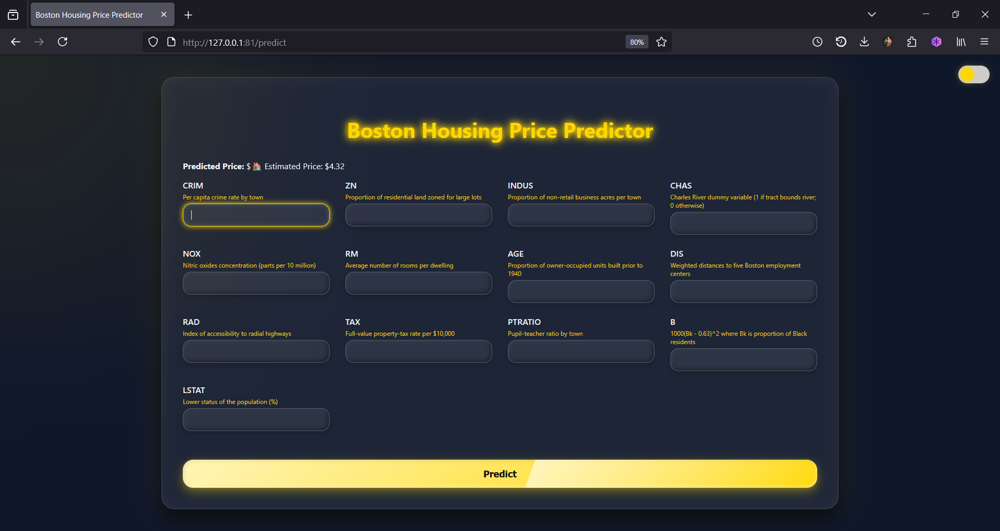

# 🏠 Boston Housing Price Predictor

[](https://www.python.org/)
[](https://flask.palletsprojects.com/)
[]()
[]()

This project was built as part of the **Python Zero to Hero Bootcamp** organized by **Devtown**.  
The objective is to develop a **Linear Regression** model using the **Boston Housing Dataset** and build a **Flask web application** to deploy the model with a professional frontend interface.

---

## 🧠 Project Overview

- ✅ Machine Learning Algorithm: Linear Regression
- 📊 Dataset: Boston Housing Prices
- 🌐 Framework: Flask (Python)
- 🎨 Frontend: HTML + CSS (Light & Dark Modes)
- 💾 Model Output: `model.pkl`
- 💻 Deployment Mode: Localhost (Tested on Desktop)

---

## 📁 Project Structure

```bash
Boston-Housing-Price-Predictor/
├── app.py                   # Flask backend
├── BostonHousing.ipynb      # Jupyter notebook for training
├── model.pkl                # Saved ML model
├── /templates
│   └── index.html           # Frontend HTML page
├── /static
│   └── style.css            # Custom styling
├── /IMAGES
│   ├── light_mode_1.png
│   ├── light_mode_2.png
│   ├── dark_mode_1.png
│   └── dark_mode_2.png
```

---

## 🚀 Getting Started Locally

1. **Clone the repository**
```bash
git clone https://github.com/MATHEESHA2/Boston-Housing-Price-Predictor.git
cd Boston-Housing-Price-Predictor
```

2. **Install dependencies**
```bash
pip install -r requirements.txt
```

3. **Run the application**
```bash
python app.py
```

4. **Visit**
```
http://127.0.0.1:5000
```

---

## 📷 Preview

### 💡 Light Mode




### 🌙 Dark Mode




---

## 🙋‍♂️ About Me

**Matheesha Gamage**

- 🎓 University: University of Ruhuna  
- 🏢 Faculty: Faculty of Engineering  
- 🧑‍💻 Passionate about Machine Learning, Web Development, and Software Engineering

### 📬 Contact Me

- [](https://www.linkedin.com/in/matheesha-gamage)  
- []()

---

> Crafted with ❤️ by Matheesha Gamage
